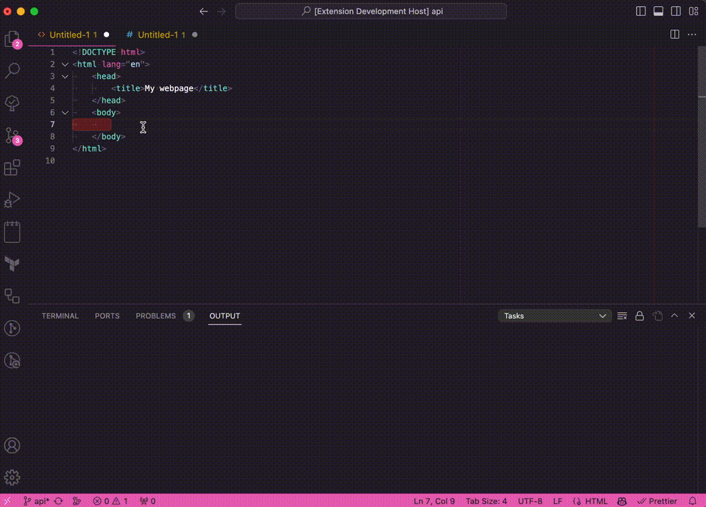

# Icon Snippets

Allows the user to insert SVG icons from popular libraries directly into their markup without having to search for them.

## Example

Start typing the word `icon-` and you'll see a list of available icons appear with a preview. Press enter to add the SVG code to your document.

## Release Notes

### 0.2.0

-   Removed style tags from icons
-   Removed deprecated attributes
-   Removed Adobe comments

### 0.0.1

-   Initial creation of Icon Snippets

#### Packaging

We are using `vsce` to package and publish. `yarn vsce publish`

If we have an expired personal access token, then we can login again.

    You're using an expired Personal Access Token, please get a new PAT.
    More info: https://aka.ms/vscodepat
    error Command failed with exit code 1.

Get your token here: https://dev.azure.com/PolymerMallard/
This is your panel: https://marketplace.visualstudio.com/manage
Login through CLI: `yarn vsce login PolymerMallard`
